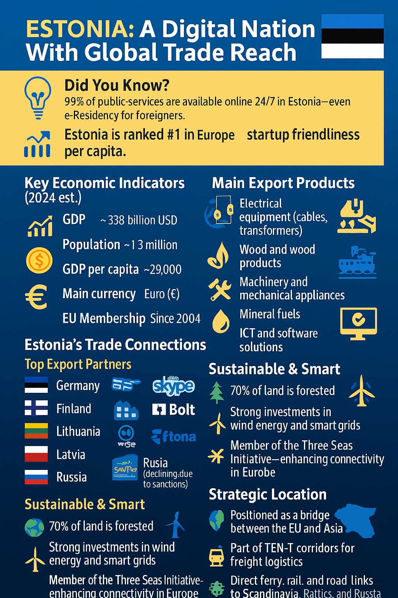
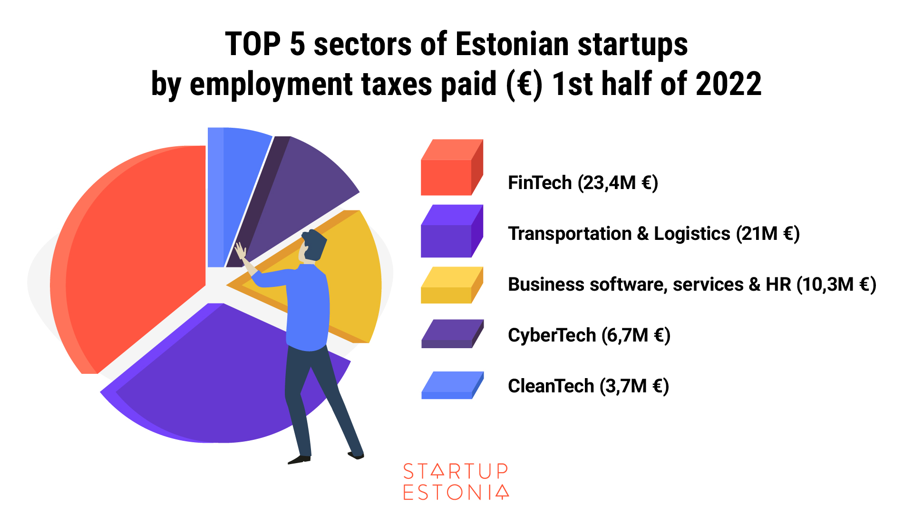
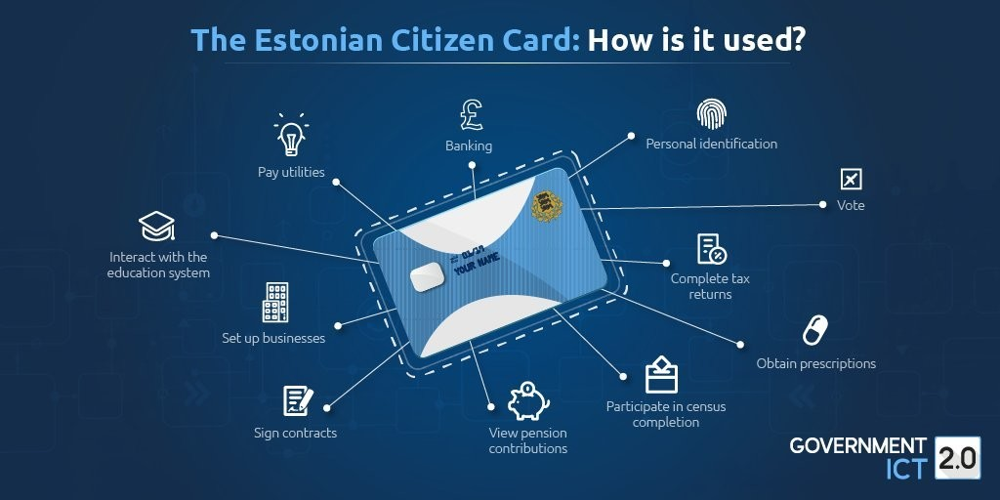

# 🇪🇪 Estonia Investment Overview

---

## 📊 Key Statistics

---

## 🌟 Northern Europe's Hub for Knowledge and Digital Business

> Estonia offers world-class human capital, unique digital capabilities, and a competitive business environment, making it an ideal location for businesses with global ambition. The country provides investment incentives of up to 15% return on investment.

### 🏆 Key Rankings

| Ranking | Category |
|---------|----------|
| #1 | Tax Competitiveness |
| #1 | Number of Unicorns per Capita |
| Top | Digital Capabilities |
| Top | Ease of Doing Business |

---

## 💪 Core Advantages

### 1. 👥 Smart People

- **Education Excellence**
  - High-achieving workforce with extensive IT education from primary school
  - Top 10 global rankings in science, mathematics, and reading
  - Multilingual workforce with high value-added capabilities

- **World-Class Skills**
  - Engineering and electronics
  - Software development
  - High-tech systems
  - Cybersecurity
  - IoT, Blockchain, and telecommunications

### 2. 🏢 Pro-Business Environment

- **Economic Strengths**
  - One of the most open, competitive, and transparent economies globally
  - Low red tape and strong rule of law
  - Significant investment in infrastructure and human capital
  - Ultra-high IT usage across the economy

- **R&D Ecosystem**
  - Ericsson
  - NATO
  - Telia (5G telecommunications)
  - Google (location technologies)

### 3. 💻 Digitally Enabled Nation

- **Digital Leadership**
  - World's most advanced digital society
  - Leader in digital skills, infrastructure, and legislation
  - Pioneer in e-Residency program
  - Full digital ecosystem with world-class cybersecurity
  - 5G infrastructure development

- **Success Stories**
  - Fortumo
  - Guardtime
  - Skeleton Technologies
  - Microsoft
  - CGI
  - Fujitsu

### 4. 🌍 Scalable Location

- **Global Integration**
  - Highly globalized economy
  - Full EU and Eurozone membership
  - Strategic location for pan-European activity
  - Integrated supply chains

- **Global Presence**
  - ABB
  - Ericsson
  - Export solutions to over 130 countries

### 5. 📈 Solid Investment Track Record

- **Competitive Edge**
  - Competitive costs by European standards
  - High added value through productive workers
  - Excellent IP commercialization record
  - Most competitive tax code in the OECD
  - Strong investment-grade credit rating

---

## 🎯 Key Investment Sectors

| Sector | Focus |
|--------|-------|
| Electronics | Manufacturing & Innovation |
| IT R&D | Software & Services |
| Industrial R&D | Engineering & Development |
| Food | Production & Processing |
| Business Services | Professional Services |
| Bioeconomy/Timber | Sustainable Resources |
| Logistics | Supply Chain |
| Cybersecurity | Digital Security |
| Blockchain | Distributed Ledger |
| Chemicals | Industrial Chemicals |
| e-Health | Digital Healthcare |
| Marine | Maritime Industry |

---

## 💰 Investment Incentives

| Incentive | Details |
|-----------|---------|
| Grant Amount | Up to €20M per project |
| Return Rate | Up to 15% of investment |
| Focus Areas | Competitiveness, Export, Added Value |

---

## 🤝 Support Services

The Estonian Investment Agency provides comprehensive support through:

- 📞 Complimentary e-Consulting service
- 🌐 Virtual investment visits
- 📋 Guidance through investment process
- 📊 Sector-specific information
- 🤝 Partnership opportunities

---

*For more detailed information and current updates, visit [investinestonia.com](https://investinestonia.com/)*

 